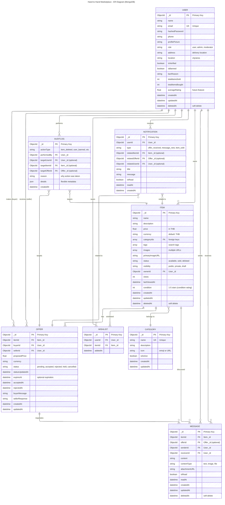

# Hand to Hand Marketplace

A second-hand marketplace platform for students, staff, and lecturers at KMITL. Built with React, Node.js/Express, and MongoDB.

---

## Database Schema - ER Diagrams

The database uses MongoDB (NoSQL) with the following entity relationships. Choose your preferred diagram format:

### 1. Mermaid Diagram (Recommended for GitHub)


### 2. PlantUML Diagram (For Detailed Documentation)
View the PlantUML diagram at: [ER_Diagram.puml](./ER_Diagram.puml)

- **Online Editor**: [PlantUML Online Editor](https://www.plantuml.com/plantuml-online-editor.php)
- **VSCode**: Install "PlantUML" extension (jebbs.plantuml)
- **Features**: Detailed field descriptions, comprehensive relationship labels, and professional documentation notes

### 3. DBML Diagram (For dbdiagram.io)
View the DBML diagram at: [ER_Diagram.dbml](./ER_Diagram.dbml)

- **Online Editor**: [dbdiagram.io](https://dbdiagram.io)
- **Import**: Copy-paste the DBML file content to visualize
- **Features**: SQL-style syntax, index definitions, and database normalization support

---

## Database Entities

| Entity | Purpose |
|--------|---------|
| **USER** | User accounts with authentication, roles, and statistics |
| **CATEGORY** | Centralized product categories for filtering |
| **ITEM** | Product listings with images, condition rating (1-5 stars), and status |
| **OFFER** | Buyer-seller negotiations with status tracking |
| **MESSAGE** | Real-time messaging system with read status |
| **WISHLIST** | User-saved items for future reference |
| **AUDITLOG** | Admin action tracking for compliance |
| **NOTIFICATION** | Push notification system for user engagement |

---

## Key Design Features

✅ **Soft Deletes** - Data integrity with `deletedAt` flags  
✅ **Role-Based Access** - User roles (user, admin, moderator)  
✅ **Condition Rating** - Integer 1-5 star system for item condition  
✅ **Audit Trail** - Complete admin action logging  
✅ **Notification System** - Ready for real-time Socket.io integration  
✅ **Future-Proof** - Arrays for images/tags support scalability  
✅ **Proper Indexing** - Performance optimization on frequent queries  

---

# Authentication System (JWT + bcrypt)

This project implements a JWT-based authentication system with secure password handling.
The backend supports two authentication approaches to stay compatible with different frontend implementations.

The goal is to keep authentication logic clear, maintainable, and aligned with common backend practices.

---

## Authentication Design Overview

Authentication responsibilities are split as follows:

- **Password security** is handled using `bcrypt`
- **User authentication and session management** is handled using JSON Web Tokens (JWT)

Password hashing is only used during registration and login.
JWT is used after login to authenticate and authorize API requests.

These two concerns are intentionally kept separate.

---

## Why JWT Is Used

JWT is used because the application follows a frontend–backend separation and exposes a REST API.

JWT allows:
- Stateless authentication
- Protected routes
- Role-based access control
- No server-side session storage

JWT is not related to how passwords are hashed and should remain unchanged regardless of the password hashing strategy.

---

## Supported Authentication Modes

### Mode 1: JWT + bcrypt (Recommended)

This is the standard and recommended implementation.

#### Flow
1. Frontend sends the raw password over HTTPS
2. Backend hashes the password using bcrypt during registration
3. Backend verifies the password using bcrypt during login
4. Backend issues a JWT on successful authentication
5. Frontend includes the JWT in subsequent API requests

#### Notes
- Password hashing is fully controlled by the backend
- This approach is secure, maintainable, and widely used
- This should be the default mode going forward

---

### Mode 2: JWT + frontend jhash + backend bcrypt (Compatibility Mode)

This mode exists to support a frontend that hashes passwords before sending them to the backend.

#### Flow
1. Frontend hashes the password using `jhash`
2. Frontend sends the hashed value to the backend
3. Backend hashes the jhash output using bcrypt during registration
4. Backend compares bcrypt(jhash(password)) during login
5. Backend issues a JWT on successful authentication

#### Notes
- The backend never receives the raw password
- bcrypt treats the jhash output as the password
- Any change to the frontend hashing algorithm will invalidate stored passwords
- This approach is not recommended for production use

This mode should be considered temporary and used only for compatibility during development.

---

## Security Considerations

- bcrypt cannot directly compare hashes produced by another algorithm
- Hashing a value multiple times with different algorithms does not improve security
- HTTPS already protects passwords in transit
- Password hashing should ideally be handled only by the backend

Long-term recommendation: remove frontend hashing and rely exclusively on backend bcrypt.

---

## Environment Variables

```env
JWT_SECRET=your_secret_key
JWT_EXPIRES_IN=1h